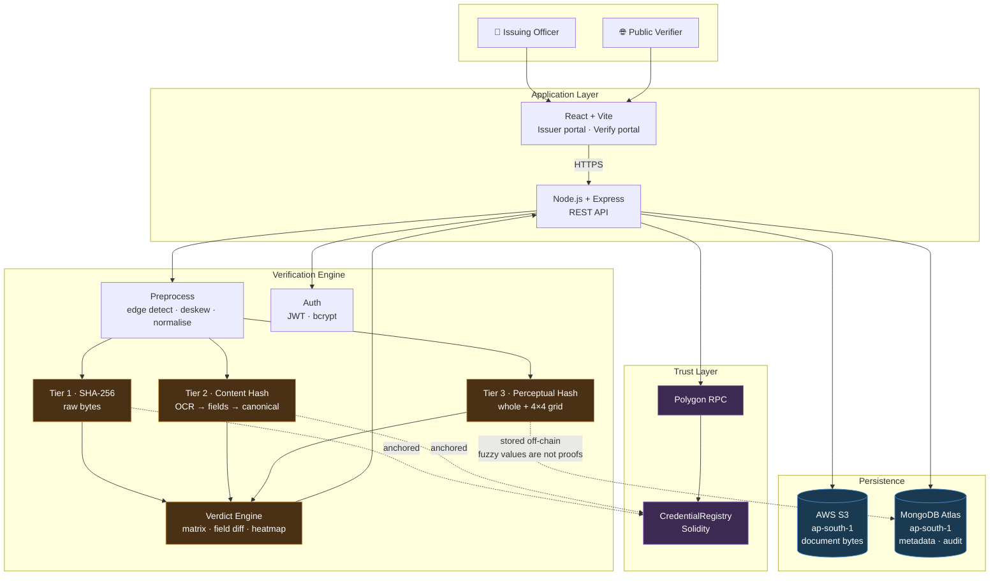
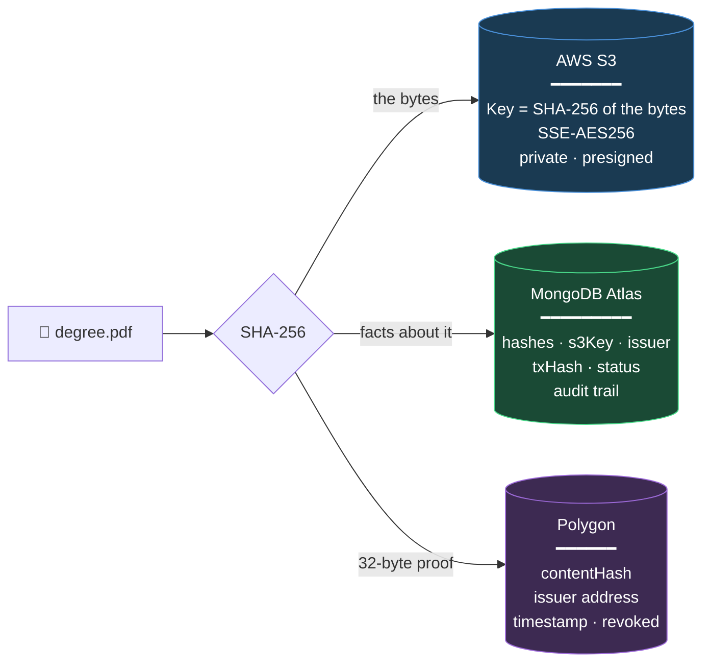
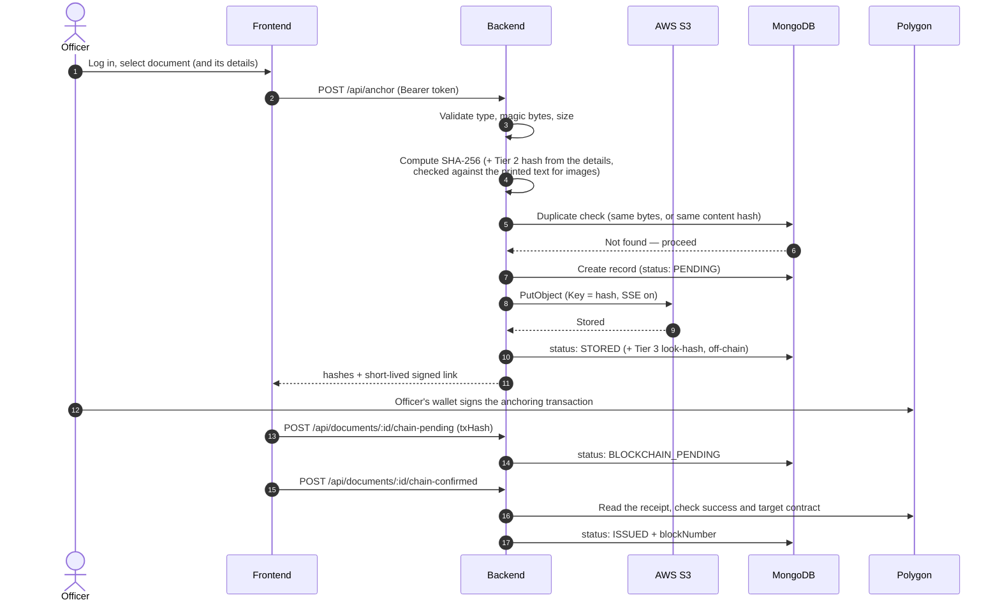
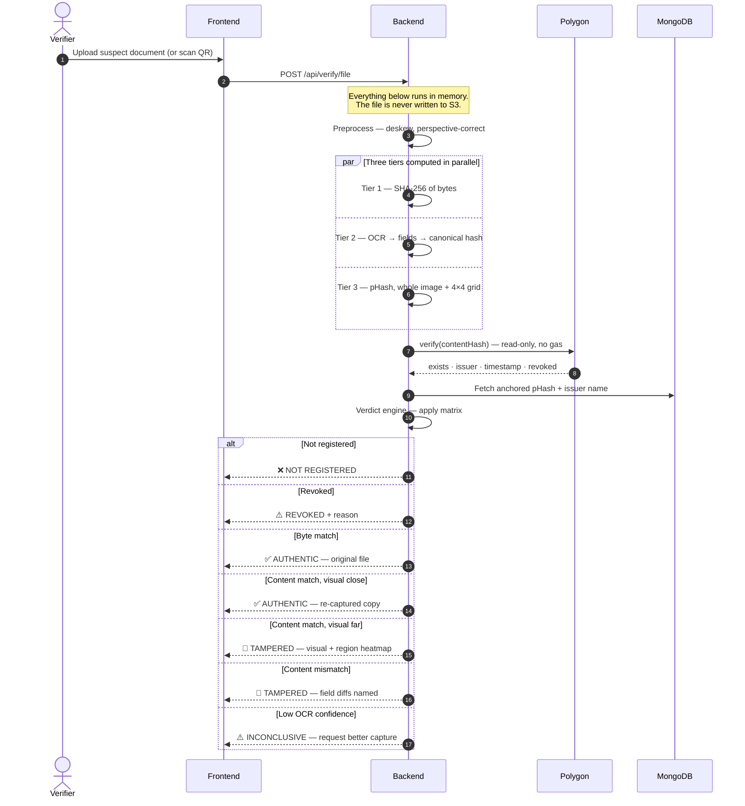

# MindForge

**Blockchain-anchored document issuance and verification for institutional credentials.**

MindForge lets an authorised institution issue a document whose integrity can later be verified by anyone — without the verifier needing access to the issuing institution's database, credentials, or systems.

The document itself never touches the blockchain. Only a cryptographic fingerprint does.

> **Read this first: what is built and what is a design.** Parts of this README describe the intended system. The
> [Implementation Status](#implementation-status) table says, capability by capability, what exists in the code today, and the
> flow diagrams are labelled *implemented* or *target design*. Where the two differ, the status table is the truth.

---

## Table of Contents

- [The Problem](#the-problem)
- [How It Works](#how-it-works)
- [Tamper Detection](#tamper-detection)
- [System Architecture](#system-architecture)
- [Where Data Is Stored](#where-data-is-stored)
- [Data Flows](#data-flows)
- [Implementation Status](#implementation-status)
- [Technology Stack](#technology-stack)
- [Getting Started](#getting-started)
- [Environment Variables](#environment-variables)
- [API Reference](#api-reference)
- [Security](#security)
- [Compliance](#compliance)
- [Troubleshooting](#troubleshooting)
- [Roadmap](#roadmap)

---

## The Problem

India already has strong infrastructure for verifying documents the government issued **digitally** — DigiLocker serves over 100 million users, and the National Academic Depository covers degrees.

The gap is everything else:

- The paper certificate in someone's hand
- A scan that arrived over WhatsApp, recompressed three times
- A photograph of a printout handed across a desk
- A deed produced by an office that never digitised

For these, verification is still manual, slow, and dependent on trusting whoever is holding the paper. MindForge targets that gap specifically.

> **What this does not do.** A blockchain match proves a document corresponds to a fingerprint previously recorded by an authorised issuer. It does not prove the real-world facts inside the document were true when issued. Integrity is not veracity.

---

## How It Works

A single hash can only answer one question. MindForge computes three, because verification and tamper-detection are different problems.

| Tier | Fingerprint | Question it answers | Authority |
|---|---|---|---|
| **1** | SHA-256 of raw bytes | Is this the **exact original file**? | Proof |
| **2** | Canonical content hash | Is this the **same document**? | **Primary verdict** |
| **3** | Perceptual hash | Does it **look** consistent? | Advisory only |

**Tier 1** is absolute but brittle — re-save a PDF, photograph a certificate, or forward it over WhatsApp and the bytes change, so a genuine document fails.

**Tier 2** solves that. The document is OCR'd, its fields extracted and normalised, and *that record* is hashed. Pixels are discarded before hashing, so compression, resizing, mild rotation, lighting and viewing angle largely stop mattering (measured on simulated copies of one template, not yet on real phones) — but altering a name or a date changes the hash deterministically, and we can name the field that moved. It reads one controlled certificate template, and images only (not PDFs).

**Tier 3** catches what Tier 2 cannot: a substituted photograph, where the text reads identically but the appearance has changed.

> **Why Tier 3 is never the authority.** Every ID of a given type shares one template. After perceptual hashing downsamples and discards high-frequency detail, a *different person's* card lands within a few bits of yours. Used as the deciding vote it would verify your friend's Aadhaar as your own. It may confirm or flag — never approve.

Four properties follow from this design:

| Property | Why |
|---|---|
| **Privacy-preserving** | No document content and no personal data on-chain. Only hashes. |
| **Constant on-chain size** | The on-chain record is 32 bytes whatever the document's size. (Uploads to this system are limited to PDF, PNG and JPEG up to 10 MB.) |
| **Independently verifiable** | The public chain can be read directly: no API key, no account. (Reproducing a Tier 2 hash needs the same field extraction this system performs.) |
| **Resilient** | In simulated tests a genuine copy that was recompressed, shrunk, rotated, dimmed or photographed at an angle still matched; two extreme cases (heavy blur, 25° rotation) were reported inconclusive and none was wrongly called altered. Real phone captures have not been measured. |

---

## Tamper Detection

The verdict comes from how the three tiers **disagree**, not from any one of them.

| Tier 1 | Tier 2 | Tier 3 | Verdict | Meaning |
|:---:|:---:|:---:|---|---|
| ✅ | ✅ | ✅ | `AUTHENTIC_ORIGINAL` | Untouched original file |
| ❌ | ✅ | close | `AUTHENTIC_COPY` | Scan, photo or forward — content intact |
| ❌ | ✅ | **far** | `TAMPERED_VISUAL` | Text identical, appearance changed → photo substitution |
| ❌ | ❌ | any | `TAMPERED_CONTENT` | A field was altered — reported by name |
| ❌ | ⚠️ | any | `INCONCLUSIVE` | OCR unreliable; a better capture is requested |

Row 3 is the point of the design: **neither byte-hashing nor content-hashing alone detects a swapped photograph.** Their disagreement does.

### Localising the change

Whole-image comparison only says *something* changed. To say **where**, the normalised document is tiled into a 4×4 grid and each cell hashed independently:

```
┌────┬────┬────┬────┐
│ ok │ ok │ ok │ ok │
├────┼────┼────┼────┤
│🔴18│ ok │ ok │ ok │   ← photo region, Hamming distance 18
├────┼────┼────┼────┤      every other cell ≤ 4
│ ok │ ok │ ok │ ok │
└────┴────┴────┴────┘
```

One cell diverging while the rest stay tight indicates a **localised edit**. Many cells diverging at once is reported as **unclear**: it could be a bad capture or a different document, and a disturbed picture is never read as "just a re-capture, so fine". Because a photo box occupies only part of its grid tile, the template's photo region is also hashed on its own, which separates a swapped photo far more clearly. Per-cell distances are computed for a heatmap (`backend/phash.js`); the heatmap UI itself is not built yet.

### Evidence, not a boolean

The verdict engine (`backend/forensics.js`) returns a structured report like this one. It is implemented and unit-tested, but **not yet connected to a verification endpoint** (#66).

```json
{
  "verdict": "TAMPERED_CONTENT",
  "confidence": "HIGH",
  "tiers": {
    "byte":    { "match": false },
    "content": { "match": false,
                 "fieldDiffs": [
                   { "field": "dob", "anchored": "2005-04-12", "presented": "2003-04-12" }
                 ]},
    "visual":  { "distance": 6, "regions": [[2,3,2,4],[18,3,2,3],[3,2,4,3],[2,3,3,2]] }
  },
  "anchor": { "issuer": "NITC Registrar", "issuedAt": "2026-10-09", "txHash": "0x8f2e…" }
}
```

---

## System Architecture



**Note which tiers are anchored.** Tiers 1 and 2 are deterministic, so they go on-chain as proofs. Tier 3 is a similarity score with a tunable threshold — it lives in MongoDB, because a fuzzy value anchored in an immutable ledger would imply a certainty it does not have.

*This diagram is the target architecture.* Not yet connected: the Verdict Engine to the API, backend-side anchoring (the officer's wallet signs today), and the new `CredentialRegistry` (written and tested in `blockchain/`, not yet deployed; the frontend still calls the old contract).

**Design rule:** the backend is the only component holding secrets. The browser never sees a database URI or a cloud credential. Public verification requires no wallet and no browser extension. (Today the issuing officer's own wallet, such as MetaMask, signs the anchoring transaction in their browser; moving that signing to the backend is part of the target design.)

---

## Where Data Is Stored

Each store holds exactly what it is good at. Nothing is duplicated across them.



### Responsibility split

| Store | Holds | Why not elsewhere |
|---|---|---|
| **AWS S3** | The actual PDF / PNG / JPEG | MongoDB caps documents at **16 MB** (BSON limit) and our M0 tier is 512 MB total — roughly 250 scanned PDFs before the cluster is full. S3 is ~10× cheaper per GB, serves downloads through short-lived presigned URLs (uploads do pass through the API for validation), and gives versioning, lifecycle rules, and object-level encryption. |
| **MongoDB Atlas** | Metadata, status, audit events | S3 is a key-value blob store — it can only answer *"what are the bytes at key X?"* It cannot answer *"which documents did this officer issue?"* or *"has this hash already been anchored?"* without scanning the entire bucket. |
| **Polygon** | 32-byte hash + issuer + timestamp | Storing a 1 MB file on-chain would cost millions in gas, be permanently public, and be impossible to erase. Only the integrity proof needs to be tamper-evident. |

**The hash is the join key.** The S3 object is keyed by the SHA-256 of the file's bytes (Tier 1). The MongoDB record holds that same hash plus the Tier 2 content hash, and the Tier 2 content hash is what the contract is keyed by:

```
MongoDB record                    S3 object            Blockchain (CredentialRegistry)
──────────────                    ─────────            ───────────────────────────────
sha256:      "a17bc9…"   ────►    Key: "a17bc9…"
contentHash: "5e03d1…"   ─────────────────────────►    records["5e03d1…"]
s3Key:       "a17bc9…"            (the file bytes)      { issuer, issuedAt, revoked, byteHash }
issuerName:  "registrar"
txHash:      "0x8f2e…"
status:      "ISSUED"
```

**What MongoDB does hold that is personal data.** For a document issued with its details, MongoDB keeps the canonical fields (name, date of birth, ID number) so that a mismatch can say *which field* changed, old against new. That is personal data at rest, readable only by the issuer's authenticated session and never included in the record view returned to clients.

### What is deliberately **not** stored

| Never stored | Where it would have leaked | Why |
|---|---|---|
| Document contents on-chain | Blockchain | Permanent, public, unerasable |
| Personal data on-chain | Blockchain | Conflicts with DPDP Act erasure rights |
| Secrets in MongoDB | Database | Credentials belong in env config only |
| Secrets in `VITE_*` vars | Frontend bundle | Vite inlines these into the browser — publishing them |
| Suspect files during verification | S3 | Verification hashes in memory and discards |
| Request bodies in logs | Log files | That would be document contents |

---

## Data Flows

### Issuance — authorised officer (implemented, except where marked)



**What differs from the target design.** The officer's wallet signs the transaction, not the backend (`backend/src/services/blockchain.service.js` exists for backend signing but is not wired in). The frontend still calls the **old, ungated** contract, so the issuer allowlist in the new `CredentialRegistry` is not yet enforced in practice. There is no QR step yet (#58).

**Failure handling.** The record is created `PENDING` *before* the upload, so a crash leaves a visible row rather than an invisible orphan. If a step fails the record is marked `FAILED` with a short reason code; the stored object is **kept** (its key is the content hash, so a retry reuses it). Re-submitting the same file, or a re-photographed copy of the same document, returns the existing record instead of issuing twice. `npm run reconcile` resolves records stuck part-way by asking the chain what happened.

### Verification — public, no wallet required (**target design, not yet implemented**)

> Today the public screen hashes the uploaded file in memory (`POST /api/hash`, nothing is stored) and the browser looks that hash up on chain. The flow below, where the backend computes all three tiers and applies the verdict matrix, is what #66 will build. Its parts exist separately: `backend/tier2.js`, `backend/phash.js`, `backend/forensics.js`.



Verification is meant to be a **read-only** chain call: no gas, no wallet, no account. Each verification attempt is recorded in the audit trail (action, verdict, truncated network address; never the file or its hash).

---

## Implementation Status

Status is tracked honestly so that documentation never overstates the code. ✅ built and tested · 🟡 built, with the stated gap · ❌ not built.

| Capability | Status | Detail | Tracking |
|---|---|---|---|
| Tier 1 — byte hash (SHA-256) | ✅ | `POST /api/hash` (stores nothing) and `POST /api/anchor` | — |
| Authentication | 🟡 | bcrypt + short-lived JWT for **one** account set in the environment; no user database, password reset or per-user roles | — |
| Upload validation, HTTP hardening, redacted logging | ✅ | type + magic-byte check, size cap, helmet, CORS allowlist, rate limits, secrets scrubbed from logs | — |
| S3 storage | 🟡 | content-addressed keys, server-side encryption, ≤5-minute signed links, `npm run check-bucket`. Tested with a fake client; **never run against a real bucket** | — |
| MongoDB layer | ✅ | document model, issuance state machine with recovery sweep, audit trail with expiry. Tested against a real MongoDB | — |
| Tier 2 — canonical content hash | 🟡 | OCR, flattening, label-anchored extraction, field-level diff; **one template, images only**; proven on simulated copies, **not real phones**; not yet anchored on chain. Two implementations currently exist (`backend/*.js` and `backend/src/services/`); one will be retired | #52 |
| Tier 3 — perceptual hash + region grid | 🟡 | built, stored off-chain, advisory only; thresholds measured on **simulated** data; not used by any endpoint yet | #65 |
| Tamper forensics / verdict engine | 🟡 | engine and verdict card built and unit-tested; the seven adversarial cases are tested as signals, not with real images; **no endpoint calls it** | #66 |
| On-chain issuer authorisation | 🟡 | `blockchain/` contract, ABI and 19 passing tests; **not deployed**, source not verified on an explorer. The old, ungated contract `0x1477…` is on **Ethereum Sepolia, not Polygon Amoy** (checked by bytecode) | #62 |
| Revocation | 🟡 | contract function only; no API, UI or database mirror | #59 |
| QR verification | ❌ | | #58 |
| Officer dashboard, routing, error boundary | ❌ | | #60 |
| Forgery test corpus | ❌ | tests use synthetic fixtures generated in code | #74 |
| Tests | 🟡 | ~270 backend tests (`cd backend && npm test`), Hardhat tests in `blockchain/test`; **no frontend tests** | — |

**Known limitation — what is proven.** The Tier 2 and Tier 3 results come from simulated damage to one synthetic certificate (compression, resizing, rotation, noise, a drawn perspective). That is evidence the method works, not proof it works on photographs from real phones. The confidence threshold and Tier 3 distances must be re-measured on real captures before anyone relies on them (`npm run robustness`, `npm run calibrate-tier3` in `backend/`).

**Known limitation — perceptual hashing.** Documents sharing a template produce similar perceptual hashes regardless of holder, and edits to printed text are invisible to it. Measured on the simulated set: a different person's card and a changed date of birth both read as consistent. Only a swapped *photo* is flagged. This is why Tier 3 is advisory only and can never approve a document on its own (see `backend/TIER3.md`).

## Technology Stack

| Layer | Technology |
|---|---|
| Frontend | React 18, Vite 7, Tailwind CSS 3 |
| Backend | Node.js, Express 5 |
| Database | MongoDB Atlas (AWS `ap-south-1`) |
| Object storage | AWS S3 (`ap-south-1`) |
| Blockchain | Polygon Amoy testnet (chain `80002`) |
| Web3 | Ethers v6 |
| Contract | Solidity (Hardhat project in `blockchain/`) |
| Hashing | SHA-256; DCT perceptual hash |
| Document reading | Tesseract.js (local OCR, English data committed in `backend/ocr-data/`), sharp |

> **Testnet notice.** Amoy is a test network with no economic security, and testnets are periodically deprecated. This is a demonstration deployment — it should not be described as immutable production infrastructure. A production deployment would target Polygon mainnet or a permissioned institutional chain.

---

## Getting Started

### Prerequisites

Node.js LTS · npm · a MongoDB Atlas account · an AWS account with an S3 bucket · a funded Polygon Amoy wallet

### Install

```bash
git clone https://github.com/jpsiddharth2008/MindForge-Tatva-Finals.git
cd MindForge-Tatva-Finals
```

**Backend**

```bash
cd backend
npm install
cp .env.example .env     # then fill it in — see below
npm run dev
npm test                 # ~270 tests; needs no cloud account
```

**Frontend** (separate terminal)

```bash
cd frontend
npm install
cp .env.example .env
npm run dev
```

| Service | URL |
|---|---|
| Frontend | http://localhost:5173 |
| API | http://localhost:5000 |
| Health | http://localhost:5000/api/health |

---

## Environment Variables

### `backend/.env` — secrets live here, and only here

`backend/.env.example` is the authoritative list with comments. The names the code actually reads:

```ini
PORT=5000
CORS_ORIGINS=http://localhost:5173        # exact origins; required in production
MAX_FILE_SIZE_MB=10
RATE_LIMIT_PER_MIN=                       # default 30 on /api/hash and /api/anchor
TRUST_PROXY=                              # proxy hop count, if behind a load balancer

MONGODB_URI=                              # without it the server runs but records nothing
AUDIT_RETENTION_DAYS=365

BUCKET_NAME=
REGION=ap-south-1
AWS_ACCESS_KEY_ID=
AWS_SECRET_ACCESS_KEY=
S3_SSE=AES256                             # or aws:kms (+ S3_KMS_KEY_ID)
PRESIGN_TTL_SECONDS=300                   # signed links; 300 is the maximum

RPC_URL=https://rpc-amoy.polygon.technology
CHAIN_ID=80002
CONTRACT_ADDRESS=

JWT_SECRET=                               # 32+ characters; the server refuses to start without it
ADMIN_USERNAME=
ADMIN_PASSWORD_HASH=                      # bcrypt hash: echo "pw" | npm run hash-password --silent
```

The backend does not hold a signing key today (the officer's wallet signs). `blockchain/.env.example` holds the deployer key used only by Hardhat scripts.

### `frontend/.env` — public configuration only

```ini
VITE_API_URL=http://localhost:5000        # the API origin, without a path
```

> ⚠️ **Vite inlines every `VITE_*` variable into the client bundle.** They are shipped to every visitor's browser and must be treated as public. A `VITE_PRIVATE_KEY` or `VITE_MONGODB_URI` is equivalent to publishing it. Database URIs, cloud secrets, and private keys belong exclusively in `backend/.env`.

Both `.env` files are gitignored. Never commit either.

---

## API Reference

All routes are under the API origin. "Auth" means `Authorization: Bearer <token>` from `/api/auth/login`. Errors are `{ "success": false, "error": "…", "requestId": "…" }`; the request id also appears in the `X-Request-Id` header and the server log.

| Method | Endpoint | Auth | Purpose |
|---|---|---|---|
| `GET` | `/api/health` | — | Component states (never credentials or addresses) |
| `POST` | `/api/auth/login` | — | Exchange the issuer's credentials for a token |
| `POST` | `/api/hash` | — | Hash a file in memory, store nothing; records an audit event |
| `POST` | `/api/anchor` | ✅ | Store a document and create its record. Optional JSON `fields` form field adds the Tier 2 hash |
| `GET` | `/api/documents/:id` | ✅ | Document record |
| `GET` | `/api/documents/by-hash/:sha256` | ✅ | Record by byte hash |
| `GET` | `/api/documents/by-tx/:txHash` | ✅ | Record by transaction hash |
| `POST` | `/api/documents/:id/chain-pending` | ✅ | The wallet sent a transaction |
| `POST` | `/api/documents/:id/chain-confirmed` | ✅ | Server checks the transaction on chain, then marks the document issued |
| `POST` | `/api/documents/:id/chain-failed` | ✅ | The wallet rejected or failed the transaction |
| `GET` | `/api/documents/:id/audit` | ✅ | History of one of your documents |
| `GET` | `/api/audit` | ✅ | Recent audit events (filters: `action`, `outcome`, `limit`, `before`) |

**Not built yet:** listing documents (`GET /api/documents`), revocation (`POST …/revoke`), file verification (`POST /api/verify/file`), verify-by-id for QR codes (`GET /api/verify/:id`), logout and "current user".

## Security

| Control | Approach |
|---|---|
| Secrets | Environment variables only, validated at startup, never committed |
| Authentication | bcrypt password hash; signed JWT (HS256, 8-hour lifetime) sent as a Bearer token and kept in browser memory only (not in storage or cookies); login attempts are rate-limited |
| Authorisation | Issuing and record lookups need a valid token; one officer cannot read another's records; verification is public |
| On-chain authorisation | In the new contract, `anchor()` reverts unless the caller is a registered issuer. **Not yet in force**: the contract is not deployed and the frontend still calls the old, ungated one |
| Transport | HTTPS in production |
| At rest | S3 server-side encryption on every write (AES-256, or KMS if configured). MongoDB Atlas encrypts at rest by default; that is a service feature, not something this code configures |
| Object access | Signed URLs of at most 5 minutes; the code never builds a public bucket URL. The bucket's own Block Public Access setting must be checked with `npm run check-bucket` |
| Upload validation | MIME allowlist, magic-byte check, size cap |
| HTTP hardening | Helmet, environment-driven CORS allowlist, rate limiting, body size limits |
| Error handling | Generic client responses with a correlation ID; detail stays server-side |
| Logging | Structured logs with secret redaction |

### Never logged

Private keys · database URIs · cloud credentials · JWTs · passwords · request bodies on upload routes.

> Logging a full error object from Mongoose or the AWS SDK can print the connection string, credentials included. Log `err.message`, never `err`.

---

## Compliance

This project targets India's **Digital Personal Data Protection Act, 2023**, not GDPR.

| Requirement | Approach |
|---|---|
| Purpose limitation (§4–6) | Verification hashes in memory and discards the file |
| Data minimisation (§8) | Only the hash is anchored; no personal data on-chain |
| Right to erasure (§12) | **Not implemented**: there is no deletion endpoint yet. The audit trail expires on its own (default 365 days) and stores no document content or hashes |
| Security safeguards (§8(5)) | S3 encryption at rest, access control, audit logging; transport security depends on deployment (HTTPS) |
| Data localisation | Intended: AWS `ap-south-1` (Mumbai). Set by how the bucket and cluster are created; the code does not enforce it |

**On erasure and the blockchain.** The on-chain hash cannot be deleted. Deleting the document and all metadata would leave a hash with no stored link to an individual, but **the hashes are not salted today**, so this is a weaker position than it sounds: an unsalted hash of a document in a known format is open to confirmation attacks, where someone holding a candidate document can check their guess against the chain. Salting is **not implemented** and is an open design question (a per-document salt would have to be kept to allow verification, which brings the same erasure problem back). We do not claim to have solved the blockchain-privacy tension.

---

## Troubleshooting

**`querySrv ECONNREFUSED` connecting to MongoDB**
The network is blocking DNS SRV lookups — common on campus Wi-Fi. In Atlas → Connect → Drivers, select *Node.js 6.7 or later* and toggle **off** the SRV switch to obtain the long-form `mongodb://` multi-host string.

**`MODULE_NOT_FOUND` running the server**
Run from the `backend/` directory, not the repository root, and install dependencies first.

**Blockchain initialisation fails**
Check `RPC_URL` is reachable, that its chain matches `CHAIN_ID`, and that `CONTRACT_ADDRESS` has deployed bytecode on that chain. `GET /api/health` reports which of these is down without revealing the address or key. For deploying the contract, the deployer wallet needs enough POL for gas.

**Frontend cannot reach the backend**
Confirm `VITE_API_URL` and that `CORS_ORIGINS` in `backend/.env` includes the frontend origin. A request from an origin that is not listed is refused with 403. Restart Vite after changing `.env` — variables are read at build time.

**Upload rejected**
Only real PDF, PNG and JPEG files are accepted (the content is checked, not just the extension or declared type) and the size must be under `MAX_FILE_SIZE_MB`. The response says which check failed.

**The server will not start**
It exits with a message naming the missing setting (never its value): `JWT_SECRET` (32+ characters), `ADMIN_USERNAME` and `ADMIN_PASSWORD_HASH` are required.

---

## Roadmap

**Next**
Connect the verdict engine to a verification endpoint and show the region heatmap · deploy the new issuer-gated contract and point the frontend at it · anchor both the byte hash and the content hash · revocation API and UI · QR verification bound to document content · officer dashboard · measure Tier 2 and Tier 3 on real phone captures and a proper forgery corpus

**Later**
Institutional SSO and per-user roles · salting or another answer to the erasure question · deletion endpoint · batch issuance · W3C Verifiable Credentials and DID interoperability · selective disclosure via zero-knowledge proofs · mobile verification app

---

## License

No license file is currently present. Add one before treating this project as open source.
