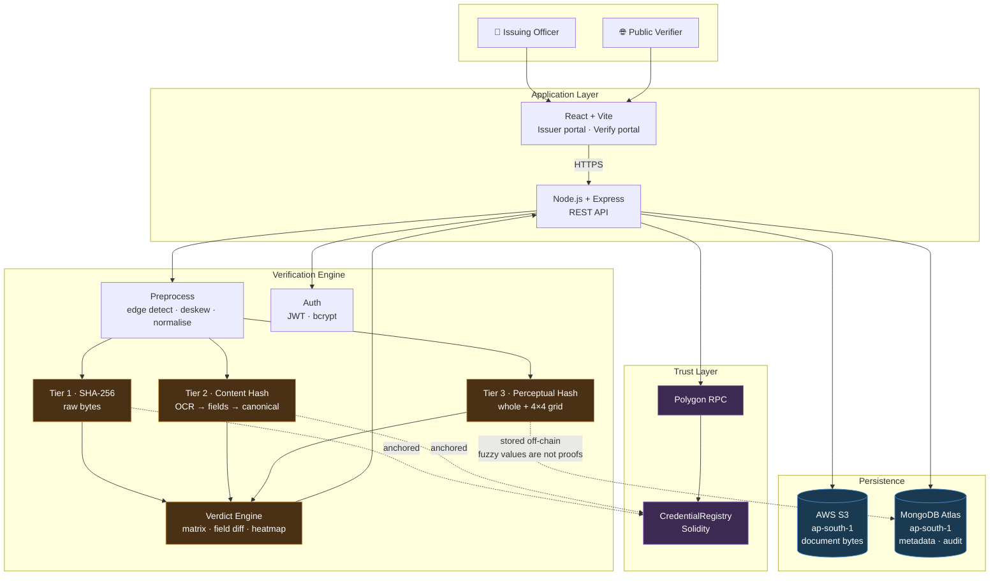
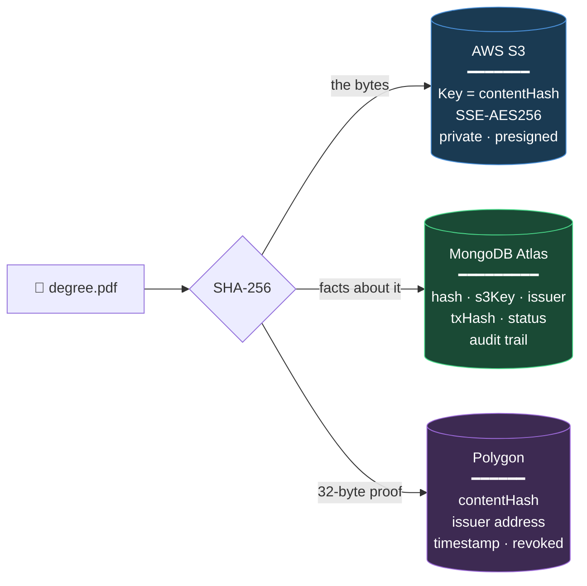
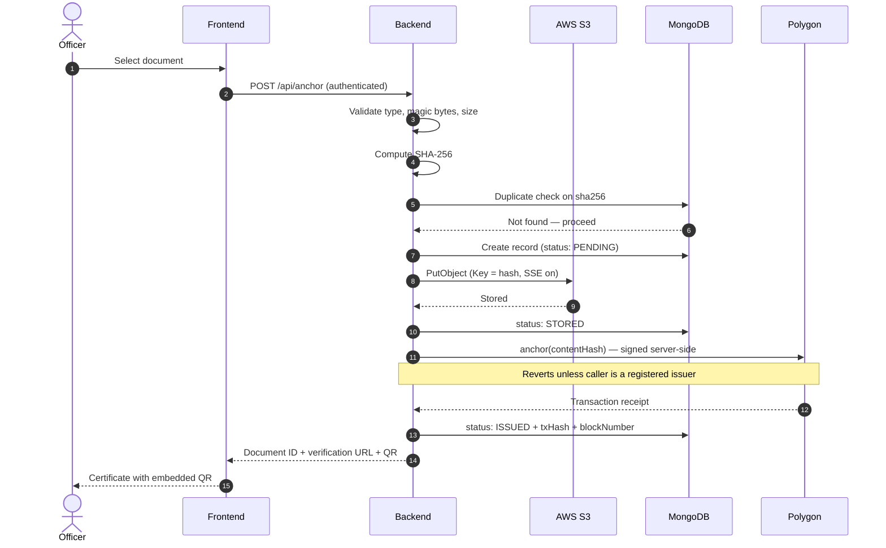
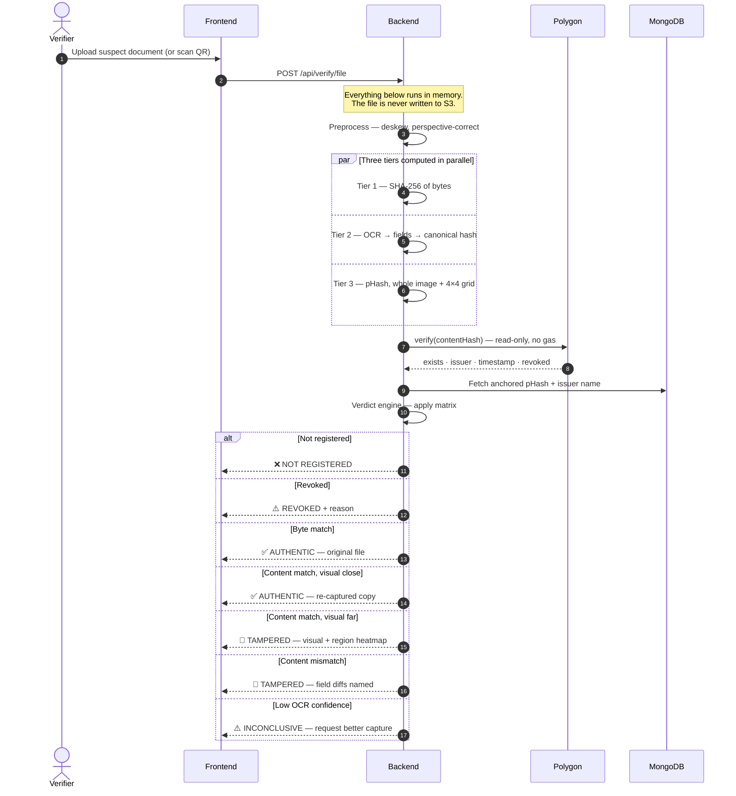

# MindForge

**Blockchain-anchored document issuance and verification for institutional credentials.**

MindForge lets an authorised institution issue a document whose integrity can later be verified by anyone — without the verifier needing access to the issuing institution's database, credentials, or systems.

The document itself never touches the blockchain. Only a cryptographic fingerprint does.

---

## Table of Contents

- [The Problem](#the-problem)
- [How It Works](#how-it-works)
- [Tamper Detection](#tamper-detection)
- [System Architecture](#system-architecture)
- [Where Data Is Stored](#where-data-is-stored)
- [Data Flows](#data-flows)
- [Implementation Status](#implementation-status)
- [Technology Stack](#technology-stack)
- [Getting Started](#getting-started)
- [Environment Variables](#environment-variables)
- [API Reference](#api-reference)
- [Security](#security)
- [Compliance](#compliance)
- [Troubleshooting](#troubleshooting)
- [Roadmap](#roadmap)

---

## The Problem

India already has strong infrastructure for verifying documents the government issued **digitally** — DigiLocker serves over 100 million users, and the National Academic Depository covers degrees.

The gap is everything else:

- The paper certificate in someone's hand
- A scan that arrived over WhatsApp, recompressed three times
- A photograph of a printout handed across a desk
- A deed produced by an office that never digitised

For these, verification is still manual, slow, and dependent on trusting whoever is holding the paper. MindForge targets that gap specifically.

> **What this does not do.** A blockchain match proves a document corresponds to a fingerprint previously recorded by an authorised issuer. It does not prove the real-world facts inside the document were true when issued. Integrity is not veracity.

---

## How It Works

A single hash can only answer one question. MindForge computes three, because verification and tamper-detection are different problems.

| Tier | Fingerprint | Question it answers | Authority |
|---|---|---|---|
| **1** | SHA-256 of raw bytes | Is this the **exact original file**? | Proof |
| **2** | Canonical content hash | Is this the **same document**? | **Primary verdict** |
| **3** | Perceptual hash | Does it **look** consistent? | Advisory only |

**Tier 1** is absolute but brittle — re-save a PDF, photograph a certificate, or forward it over WhatsApp and the bytes change, so a genuine document fails.

**Tier 2** solves that. The document is OCR'd, its fields extracted and normalised, and *that record* is hashed. Pixels are discarded before hashing, so angle, lighting, phone and compression stop mattering — but altering a name or a date changes the hash deterministically, and we can name the field that moved.

**Tier 3** catches what Tier 2 cannot: a substituted photograph, where the text reads identically but the appearance has changed.

> **Why Tier 3 is never the authority.** Every ID of a given type shares one template. After perceptual hashing downsamples and discards high-frequency detail, a *different person's* card lands within a few bits of yours. Used as the deciding vote it would verify your friend's Aadhaar as your own. It may confirm or flag — never approve.

Three properties follow from this design:

| Property | Why |
|---|---|
| **Privacy-preserving** | No document content, no personal data on-chain. Only hashes. |
| **Cheap at any size** | Verifying a 10 GB video costs the same as a 1 KB PDF — a hash is 32 bytes either way. |
| **Independently verifiable** | A verifier queries the public chain directly. No API key, no account, no trust in us. |
| **Resilient** | A genuine document still verifies after being scanned, photographed, or compressed. |

---

## Tamper Detection

The verdict comes from how the three tiers **disagree**, not from any one of them.

| Tier 1 | Tier 2 | Tier 3 | Verdict | Meaning |
|:---:|:---:|:---:|---|---|
| ✅ | ✅ | ✅ | `AUTHENTIC_ORIGINAL` | Untouched original file |
| ❌ | ✅ | close | `AUTHENTIC_COPY` | Scan, photo or forward — content intact |
| ❌ | ✅ | **far** | `TAMPERED_VISUAL` | Text identical, appearance changed → photo substitution |
| ❌ | ❌ | any | `TAMPERED_CONTENT` | A field was altered — reported by name |
| ❌ | ⚠️ | any | `INCONCLUSIVE` | OCR unreliable; a better capture is requested |

Row 3 is the point of the design: **neither byte-hashing nor content-hashing alone detects a swapped photograph.** Their disagreement does.

### Localising the change

Whole-image comparison only says *something* changed. To say **where**, the normalised document is tiled into a 4×4 grid and each cell hashed independently:

```
┌────┬────┬────┬────┐
│ ok │ ok │ ok │ ok │
├────┼────┼────┼────┤
│🔴18│ ok │ ok │ ok │   ← photo region, Hamming distance 18
├────┼────┼────┼────┤      every other cell ≤ 4
│ ok │ ok │ ok │ ok │
└────┴────┴────┴────┘
```

One cell diverging while the rest stay tight indicates a **localised edit**. Uniformly elevated distance across all cells indicates benign re-capture. The grid is returned to the UI as a heatmap with the suspect region boxed.

### Evidence, not a boolean

```json
{
  "verdict": "TAMPERED_CONTENT",
  "confidence": "HIGH",
  "tiers": {
    "byte":    { "match": false },
    "content": { "match": false,
                 "fieldDiffs": [
                   { "field": "dob", "anchored": "2005-04-12", "presented": "2003-04-12" }
                 ]},
    "visual":  { "distance": 6, "regions": [[2,3,2,4],[18,3,2,3],[3,2,4,3],[2,3,3,2]] }
  },
  "anchor": { "issuer": "NITC Registrar", "issuedAt": "2026-10-09", "txHash": "0x8f2e…" }
}
```

---

## System Architecture



**Note which tiers are anchored.** Tiers 1 and 2 are deterministic, so they go on-chain as proofs. Tier 3 is a similarity score with a tunable threshold — it lives in MongoDB, because a fuzzy value anchored in an immutable ledger would imply a certainty it does not have.

**Design rule:** the backend is the only component holding secrets. The browser never sees a private key, a database URI, or a cloud credential. Public verification requires no wallet and no browser extension.

---

## Where Data Is Stored

Each store holds exactly what it is good at. Nothing is duplicated across them.



### Responsibility split

| Store | Holds | Why not elsewhere |
|---|---|---|
| **AWS S3** | The actual PDF / PNG / JPEG | MongoDB caps documents at **16 MB** (BSON limit) and our M0 tier is 512 MB total — roughly 250 scanned PDFs before the cluster is full. S3 is ~10× cheaper per GB, serves downloads directly via presigned URLs so bytes never pass through our server, and gives versioning, lifecycle rules, and object-level encryption. |
| **MongoDB Atlas** | Metadata, status, audit events | S3 is a key-value blob store — it can only answer *"what are the bytes at key X?"* It cannot answer *"which documents did this officer issue?"* or *"has this hash already been anchored?"* without scanning the entire bucket. |
| **Polygon** | 32-byte hash + issuer + timestamp | Storing a 1 MB file on-chain would cost millions in gas, be permanently public, and be impossible to erase. Only the integrity proof needs to be tamper-evident. |

**The hash is the join key.** Because S3 objects are keyed by content hash, all three stores line up automatically:

```
MongoDB record              S3 object           Blockchain
──────────────              ─────────           ──────────
sha256: "a17bc9…"    ────►  Key: "a17bc9…"      records["a17bc9…"]
s3Key:  "a17bc9…"           (the PDF bytes)      { issuer, timestamp, revoked }
issuer: "NITC Registrar"
txHash: "0x8f2e…"
status: "ISSUED"
```

### What is deliberately **not** stored

| Never stored | Where it would have leaked | Why |
|---|---|---|
| Document contents on-chain | Blockchain | Permanent, public, unerasable |
| Personal data on-chain | Blockchain | Conflicts with DPDP Act erasure rights |
| Secrets in MongoDB | Database | Credentials belong in env config only |
| Secrets in `VITE_*` vars | Frontend bundle | Vite inlines these into the browser — publishing them |
| Suspect files during verification | S3 | Verification hashes in memory and discards |
| Request bodies in logs | Log files | That would be document contents |

---

## Data Flows

### Issuance — authorised officer



**Failure handling.** If S3 succeeds but the chain write fails, the record is marked `FAILED` and the orphaned object is removed — never a silent half-issued document. Re-submitting the same file returns the existing record rather than anchoring twice.

### Verification — public, no wallet required



Verification is a **read-only** chain call. It costs no gas, needs no wallet, and requires no account.

---

## Implementation Status

This project is under active development. Status is tracked honestly so that documentation never overstates the code.

| Capability | Status | Tracking |
|---|---|---|
| Tier 1 — byte hash (SHA-256) | ✅ Working | — |
| Tier 2 — canonical content hash | ❌ Not built | #52 |
| Tier 3 — perceptual hash + region grid | ❌ Not built | #65 |
| Tamper forensics / verdict engine | ❌ Not built | #66 |
| S3 upload | 🟡 Works; needs content-addressed keys + SSE | #51 |
| Blockchain anchor + read | 🟡 Works; needs server-side signing | #50 |
| Verification flow | 🟡 Works; must stop persisting suspect files | #50 |
| Issuer authorisation | ❌ Not built — any wallet can currently anchor | #47 |
| MongoDB metadata layer | ❌ Not built | #53 |
| Authentication | ❌ Not built | #48 |
| QR verification | ❌ Not built | #58 |
| Revocation | ❌ Not built | #59 |
| Audit trail | ❌ Not built | #61 |
| Contract source in repo | ❌ Missing | #62 |
| Tests | ❌ None | #63 |

**Known limitation.** The current build implements Tier 1 only, so any re-encoding — WhatsApp compression, re-saving a PDF, photographing a printout — produces a false negative on a genuine document. Tiers 2 and 3 (#52, #65) and the verdict engine (#66) address this.

**Known limitation — perceptual hashing.** Documents sharing a template produce similar perceptual hashes regardless of holder. Measured distance distributions for "same document re-captured" and "different document, same template" overlap. This is why Tier 3 is advisory only and can never approve a document on its own.

---

## Technology Stack

| Layer | Technology |
|---|---|
| Frontend | React 18, Vite 7, Tailwind CSS 3 |
| Backend | Node.js, Express 5 |
| Database | MongoDB Atlas (AWS `ap-south-1`) |
| Object storage | AWS S3 (`ap-south-1`) |
| Blockchain | Polygon Amoy testnet (chain `80002`) |
| Web3 | Ethers v6 |
| Contract | Solidity |
| Hashing | SHA-256 |

> **Testnet notice.** Amoy is a test network with no economic security, and testnets are periodically deprecated. This is a demonstration deployment — it should not be described as immutable production infrastructure. A production deployment would target Polygon mainnet or a permissioned institutional chain.

---

## Getting Started

### Prerequisites

Node.js LTS · npm · a MongoDB Atlas account · an AWS account with an S3 bucket · a funded Polygon Amoy wallet

### Install

```bash
git clone <repository-url>
cd MindForge
```

**Backend**

```bash
cd backend
npm install
cp .env.example .env     # then fill it in — see below
npm run dev
```

**Frontend** (separate terminal)

```bash
cd frontend
npm install
cp .env.example .env
npm run dev
```

| Service | URL |
|---|---|
| Frontend | http://localhost:5173 |
| API | http://localhost:5000 |
| Health | http://localhost:5000/api/health |

---

## Environment Variables

### `backend/.env` — secrets live here, and only here

```ini
NODE_ENV=development
PORT=5000
FRONTEND_URL=http://localhost:5173

MONGODB_URI=

AWS_ACCESS_KEY_ID=
AWS_SECRET_ACCESS_KEY=
AWS_REGION=ap-south-1
S3_BUCKET_NAME=

POLYGON_RPC_URL=https://rpc-amoy.polygon.technology
POLYGON_CHAIN_ID=80002
CONTRACT_ADDRESS=
PRIVATE_KEY=

JWT_SECRET=
JWT_EXPIRES_IN=1d

MAX_FILE_SIZE_MB=10
```

### `frontend/.env` — public configuration only

```ini
VITE_API_URL=http://localhost:5000/api
VITE_APP_NAME=MindForge
```

> ⚠️ **Vite inlines every `VITE_*` variable into the client bundle.** They are shipped to every visitor's browser and must be treated as public. A `VITE_PRIVATE_KEY` or `VITE_MONGODB_URI` is equivalent to publishing it. Database URIs, cloud secrets, and private keys belong exclusively in `backend/.env`.

Both `.env` files are gitignored. Never commit either.

---

## API Reference

| Method | Endpoint | Auth | Purpose |
|---|---|---|---|
| `GET` | `/api/health` | — | Component health |
| `POST` | `/api/auth/login` | — | Officer login |
| `POST` | `/api/auth/logout` | ✅ | End session |
| `GET` | `/api/auth/me` | ✅ | Current user |
| `POST` | `/api/anchor` | ✅ | Issue and anchor a document |
| `GET` | `/api/documents` | ✅ | List issued documents |
| `GET` | `/api/documents/:id` | ✅ | Document detail |
| `POST` | `/api/documents/:id/revoke` | ✅ | Revoke |
| `POST` | `/api/hash` | — | Hash a file, store nothing |
| `POST` | `/api/verify/file` | — | Verify an uploaded file |
| `GET` | `/api/verify/:documentId` | — | Verify by ID (QR target) |

All responses follow a consistent envelope:

```json
{ "success": true, "data": { }, "message": "" }
```

---

## Security

| Control | Approach |
|---|---|
| Secrets | Environment variables only, validated at startup, never committed |
| Authentication | bcrypt password hashing, JWT in HttpOnly cookies |
| Authorisation | Issuance restricted to authorised roles; verification public |
| On-chain authorisation | `anchor()` reverts unless the caller is a registered issuer |
| Transport | HTTPS in production |
| At rest | S3 server-side encryption; Atlas encryption at rest |
| Object access | Presigned URLs with short TTL — never public bucket URLs |
| Upload validation | MIME allowlist, magic-byte check, size cap |
| HTTP hardening | Helmet, environment-driven CORS allowlist, rate limiting, body size limits |
| Error handling | Generic client responses with a correlation ID; detail stays server-side |
| Logging | Structured logs with secret redaction |

### Never logged

Private keys · database URIs · cloud credentials · JWTs · passwords · request bodies on upload routes.

> Logging a full error object from Mongoose or the AWS SDK can print the connection string, credentials included. Log `err.message`, never `err`.

---

## Compliance

This project targets India's **Digital Personal Data Protection Act, 2023**, not GDPR.

| Requirement | Approach |
|---|---|
| Purpose limitation (§4–6) | Verification hashes in memory and discards the file |
| Data minimisation (§8) | Only the hash is anchored; no personal data on-chain |
| Right to erasure (§12) | Document and metadata are deletable; see the note below |
| Security safeguards (§8(5)) | Encryption at rest and in transit, access control, audit logging |
| Data localisation | All storage in AWS `ap-south-1` (Mumbai) |

**On erasure and the blockchain.** The on-chain hash cannot be deleted. Our position is that deleting the document and all metadata leaves a salted hash with no recoverable link to an individual. Salting matters: an unsalted hash of a known document format is vulnerable to confirmation attacks, where an adversary holding a candidate document can verify their guess. We do not claim to have "solved" the blockchain-privacy tension — we claim a specific, stated mitigation.

---

## Troubleshooting

**`querySrv ECONNREFUSED` connecting to MongoDB**
The network is blocking DNS SRV lookups — common on campus Wi-Fi. In Atlas → Connect → Drivers, select *Node.js 6.7 or later* and toggle **off** the SRV switch to obtain the long-form `mongodb://` multi-host string.

**`MODULE_NOT_FOUND` running the server**
Run from the `backend/` directory, not the repository root, and install dependencies first.

**Blockchain initialisation fails**
Check `POLYGON_RPC_URL` is reachable, that the connected chain ID matches `POLYGON_CHAIN_ID`, that `CONTRACT_ADDRESS` has deployed bytecode on that chain, and that the signer wallet holds enough POL for gas.

**Frontend cannot reach the backend**
Confirm `VITE_API_URL` and that the backend CORS allowlist includes the frontend origin. Restart Vite after changing `.env` — variables are read at build time.

**Upload rejected**
Check the file type is in the allowlist and the size is under `MAX_FILE_SIZE_MB`.

---

## Roadmap

**Near term**
Canonical content hashing so verification survives re-encoding · issuer registry with on-chain authorisation · revocation · QR verification bound to document content

**Later**
Institutional SSO · batch issuance · W3C Verifiable Credentials and DID interoperability · selective disclosure via zero-knowledge proofs · mobile verification app

---

## License

No license file is currently present. Add one before treating this project as open source.
